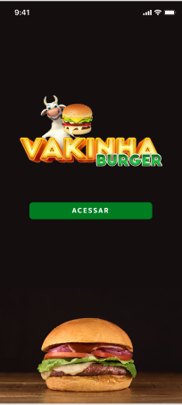
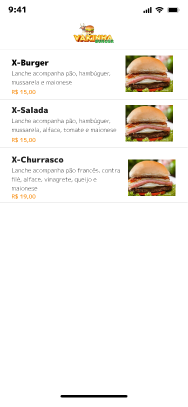

# Vakinha Burger 
### App Entrega de comida usando Flutter Bloc 

**Packages we are using:**

- flutter dotenv: [link](https://pub.dev/packages/flutter_dotenv)
- dio: [link](https://pub.dev/packages/dio)
- provider: [link](https://pub.dev/packages/provider)
- intl: [link](https://pub.dev/packages/intl)
- loading animation widget: [link](https://pub.dev/packages/loading_animation_widget)
- top snackbar flutter: [link](https://pub.dev/packages/top_snackbar_flutter)
- bloc: [link](https://pub.dev/packages/bloc)
- flutter bloc: [link](https://pub.dev/packages/flutter_bloc)
- equatable: [link](https://pub.dev/packages/equatable)
- match: [link](https://pub.dev/packages/match)
- match generator: [link](https://pub.dev/packages/match_generator)
- build runner: [link](https://pub.dev/packages/build_runner)

### Demonstração visual da tela do app

